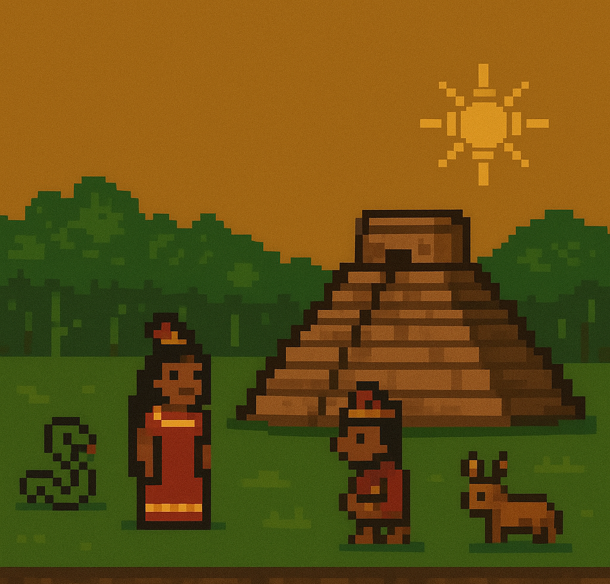

# Terra do Sol  

---

# English Version

**[Português](#versão-em-português)**

## Terra do Sol

**Terra do Sol** aims to bring the diverse and vibrant cultures of pre-Columbian South America into the world of *Dwarf Fortress*.  
This project is a respectful tribute, built around authentic representation through new civilizations, religions, creatures, and world-building elements.

The Steam Workshop release is not yet available.  
This repository currently serves **only for public presentation and documentation**.

---

## Inspiration and Design Philosophy

When *Dark Ages V* disappeared from the Steam Workshop, I felt creatively adrift. Searching for a new fantasy world to immerse myself in, I spent long periods playing *Highfantasy* and *Aeramore* — both excellent mods. However, the lack of a **"compatibility-first"** approach in those projects was often frustrating.

Those experiences inspired me to build a project that brings together:

- **A theme that fits naturally into the DF world**  

- **A modular, composable system** that interacts smoothly with both vanilla content and other mods

The cultures of pre-Columbian civilizations are rich with beauty and depth—ranging from stories of benevolent spirits guiding a young girl on a magical quest, to tales of insatiable soul-devouring beings. These narratives form the heart of this mod.

---

## Development Structure

In the early stages, the mod will be divided into several standalone modules that form the foundation for the full experience. Planned releases include:

### Magic Progression System
- **Initial framework** with standardized classes and basic skillsets

- **Expanded customization**, allowing players to combine class builds and pursue more advanced abilities  

- **Smooth progression** designed to be interesting rather than grindy—fortresses with sufficient production depth should access all content naturally

### Additional Content

- **Cosmetic and cultural elements**, enriching the aesthetic identity of each civilization  

- **New fauna and flora** to enhance regional atmosphere  

- **Language fragments**, inspired by remnants of ancient indigenous languages  

- **A final consolidated civilization**, fully playable and integrated with political, cultural, and religious systems (possibly including advanced mechanics)

Each civilization will eventually receive **five modules**, with the first three released in two development phases. This structure allows for frequent feedback cycles and community discussion.

I intend to avoid modifying vanilla raws as much as possible, testing how far I can go within DF’s natural framework. Several Workshop mods already seem compatible with the project’s goals.

---

## Final Thoughts

This is a large-scale project developed solo, so patience and kindness are appreciated.  
Creating *Terra do Sol* keeps me connected to a game I love and allows me to give back to the community that has given me so much joy.

---

# Roadmap

Symbols:  

- [x] Completed  

- ⌛ **Work in progress**  

- ❌ **Interrupted**

---

## Chapter 0: Inca Empire

- [x] Cosmogony: Willaq (Prophets) — Base magic and progression  

- ⌛ **Cosmogony: Rituals** — Magic expansion  

- [ ] **Culture: Cosmetics** — Cultural and aesthetic details  

- [ ] **Culture: Myths** — Fun and narrative content  

- [ ] **Region: Fauna** — New creatures  

- [ ] **Region: Flora** — New plant life, brewing ingredients, and ambience  

- [ ] **Language** — Linguistic and cultural immersion  

- [ ] **Fully organized and playable civilization**

---

## Chapter 1: Tupi Civilization

- [ ] Cosmogony  

- [ ] Culture  

- [ ] Region  

- [ ] Language  

- [ ] Fully organized and playable civilization  

---

## Chapter 2: Guarani Civilizations

- [ ] Cosmogony  

- [ ] Culture  

- [ ] Region  

- [ ] Language  

- [ ] Fully organized and playable civilization  

---

## Chapter ?: Tapuias? Nazca? More to come

- [ ] Cosmogony  

- [ ] Culture  

- [ ] Region  

- [ ] Language  

- [ ] Fully organized and playable civilizations  

---

## Chapter ?+1: Expansion into Mesoamerican Civilizations

- [ ] Cosmogony  

- [ ] Culture  

- [ ] Region  

- [ ] Language  

- [ ] Fully organized and playable civilizations  

---

---

# Versão em Português  
**[English](#english-version)**

## Terra do Sol

**Terra do Sol** busca trazer para *Dwarf Fortress* as ricas e diversas culturas da América do Sul pré-colombiana.  
O projeto é uma homenagem respeitosa, com foco em representação autêntica através de novas civilizações, religiões, criaturas e sistemas culturais.

A versão da Steam Workshop ainda não está disponível.  
Este repositório serve **apenas para divulgação e documentação**.

---

## Inspiração e Filosofia de Design

Quando *Dark Ages V* desapareceu da Steam Workshop, senti que havia perdido meu lugar preferido para explorar mundos fantásticos. Joguei *Highfantasy* e *Aeramore* por bastante tempo—ótimos mods, aliás—mas a falta de uma abordagem **“compatibilidade em primeiro lugar”** era frustrante.

Essas experiências me inspiraram a criar:

- **Um tema que se integra naturalmente ao mundo de DF**  

- **Um conjunto modular e expansível**, capaz de interagir bem com o jogo base e outros mods  

As culturas pré-colombianas são repletas de histórias belíssimas e poderosas—desde seres naturais benevolentes ajudando uma menina em aventura mística, até criaturas devoradoras de almas. Essas narrativas são a essência deste projeto.

---

## Estrutura de Desenvolvimento

Nos estágios iniciais, o mod será dividido em módulos independentes que formarão a base do conteúdo completo. A organização planejada inclui:

### Sistema de Progressão Mágica

- **Estrutura inicial** com classes padronizadas e habilidades básicas  

- **Expansão de customização**, permitindo combinações avançadas e builds mais fortes  

- **Progressão fluida**, focada em conveniência — fortalezas com produção suficiente devem acessar o conteúdo naturalmente

### Conteúdos Adicionais

- **Elementos culturais e cosméticos**, enriquecendo a identidade das civilizações  

- **Fauna e flora regionais**, criando maior imersão  

- **Fragmentos linguísticos**, inspirados em idiomas indígenas sobreviventes  

- **Civilização final consolidada**, totalmente jogável e integrada com sistemas políticos e religiosos (possivelmente com mecânicas avançadas)

Cada civilização receberá **cinco módulos**, sendo que os três primeiros terão duas fases de desenvolvimento. Isso garante ciclos de feedback constantes e participação da comunidade.

Pretendo evitar ao máximo alterar arquivos vanilla, testando os limites do que é possível dentro da estrutura original de DF. Já encontrei mods compatíveis e interessantes para integrar no futuro.

---

## Palavras Finais

Este é um projeto grande e estou desenvolvendo tudo sozinho; portanto, peço gentileza e paciência.  
Vejo *Terra do Sol* como uma forma de manter meu vínculo com o jogo e retribuir à comunidade que me diverte há tantos anos.

---

# Roteiro de Desenvolvimento

Símbolos:  

- [x] Completo  

**[?] Em desenvolvimento**  

**[!] Interrompido**

---

## Capítulo 0: Império Inca

**[?] Cosmogonia: Willaq (Profetas)** — Base de magia e progressão  

- [ ] **Cosmogonia: Rituais** — Expansão da magia  

- [ ] **Cultura: Cosméticos** — Cultura e estética  

- [ ] **Cultura: Mitos** — Diversão e narrativa  

- [ ] **Região: Fauna** — Novos animais  

- [ ] **Região: Flora** — Novas plantas e bebidas  

- [ ] **Linguagem** — Cultura, ambientação e aprofundamento linguístico  

- [ ] **Civilização completa e jogável**

---

## Capítulo 1: Civilização Tupi

- [ ] Cosmogonia  

- [ ] Cultura  

- [ ] Região  

- [ ] Linguagem  

- [ ] Civilização completa e jogável  

---

## Capítulo 2: Civilizações Guarani

- [ ] Cosmogonia  

- [ ] Cultura  

- [ ] Região  

- [ ] Linguagem  

- [ ] Civilização completa e jogável  

---

## Capítulo ?: Tapuias? Nazca? Outras possibilidades

- [ ] Cosmogonia  

- [ ] Cultura  

- [ ] Região  

- [ ] Linguagem  

- [ ] Civilizações completas e jogáveis  

---

## Capítulo ?+1: Expansão para Civilizações Mesoamericanas

- [ ] Cosmogonia  

- [ ] Cultura  

- [ ] Região  

- [ ] Linguagem  

- [ ] Civilizações completas e jogáveis  

---
